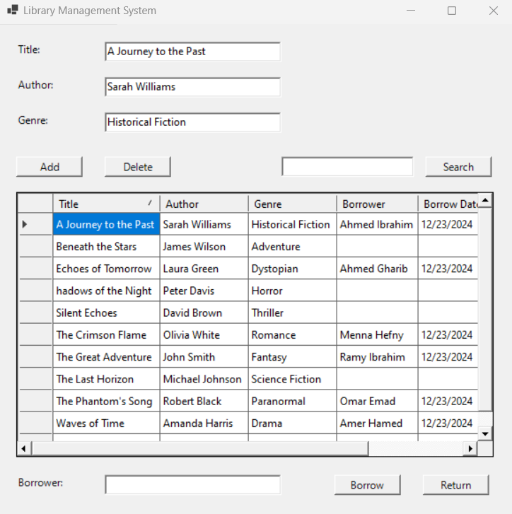

# 📚Library management system in functional paradigm by F#

Building a library management system desktop application with functional programming paradigm powered by F#.

Developed a user-friendly GUI, facilitating book borrowing, returns, searches, and book management.
